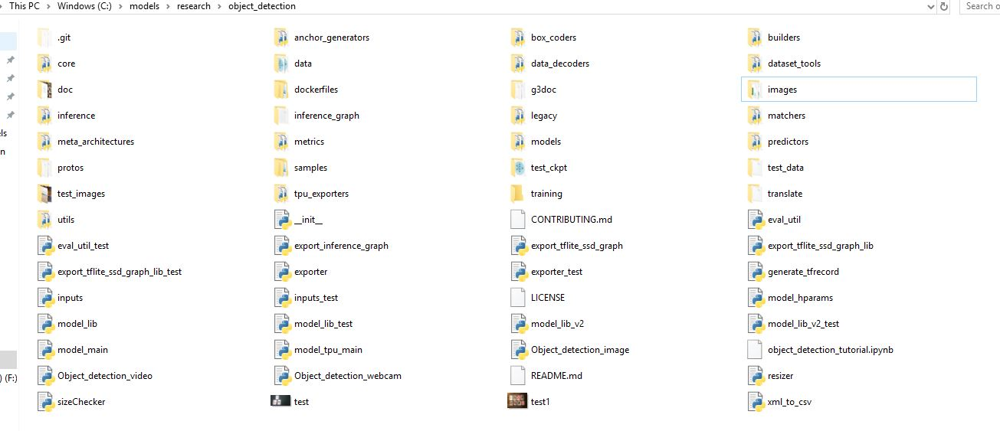

*This repo is currently under development*
# TensorFlow Lite Object Detection for Android on Windows 10
### Overview
The purpose of this document is to detail the pipeline for configuring and local training a machine learning model for object detection on Windows 10 and deploying this model to an Android mobile device.
This document and repo has been created as a modified and updated version of the official TF repo and would not have been possible without the guide [here](https://github.com/EdjeElectronics/TensorFlow-Object-Detection-API-Tutorial-Train-Multiple-Objects-Windows-10)

## Potential Issues
There are several potential pitfalls to encounter when using TensorFlow and especially when attempting to deploy the model to mobile. Common issues are addressed at the end of this README. 
Note: At the time of writing, TF2.0 currently *does not* support Object Detection as noted in the official GitHub release notes [here](https://github.com/tensorflow/tensorflow/releases/tag/v2.0.0-alpha0), [here](https://github.com/tensorflow/models/issues/7036) and [here](https://github.com/tensorflow/models/issues/6423)

## Configuration process and pipeline
We will start by setting up our virtual environment, configuring TensorFlow, gathering and labelling data (in this case, pulling images from the web that are 300x300 and of type .jpeg and using LabelImg), converting the data for use by TensorFlow, examining the data with Netron, converting our transfer learned model to .tflite and finally deploying this object detection model to Android. 

## Getting Started
Firstly, download Anaconda virtual environment. There are several version conflict issues (notably with Pip, Python and TensorFlow itself) that will prevent initialisation or training of the model, so utilising a virtual environment is neccessary.  

Navigate to [the Anaconda downloads page](https://www.anaconda.com/distribution/) and select version 3.x.x (currently 3.7) for Windows, the version suitable for Python 3.x. Don't tick the box to add PATH on installation. After installation, run the Anaconda prompt with administrator privileges and enter the following commands to create our new virtual environment named tensorflow1: 

```
(base) C:\Windows\system32> cd /
(base) C:\Windows\system32> conda create -n tensorflow1 pip python=3.5
```

Once installed, activate the virtual environment and run some updates with the below commands:
```
(base) C:\> activate tensorflow1
(tensorflow1) C:\> python -m pip install --upgrade pip
```
Failing to update pip or duplicate installs in the virtual environment will break the process. 
Then, we can install TensorFlow using pip:

```
(tensorflow1) C:\> pip install --ignore-installed --upgrade tensorflow
```
Check the version of TensorFlow with the below command. This tutorial was achieved using 1.14 but future versions should work fine. If you are running into errors that are not addressed in this document, rolling back to 1.14 may fix some issues

```
(tensorflow1) C:\> pip show tensorflow

Name: tensorflow
Version: 1.14.0
Summary: TensorFlow is an open source machine learning framework for everyone.
Home-page: https://www.tensorflow.org/
Author: Google Inc.
Author-email: packages@tensorflow.org
License: Apache 2.0
Location: c:\programdata\anaconda3\envs\tensorflow1\lib\site-packages
Requires: grpcio, keras-preprocessing, protobuf, termcolor, gast, wheel, astor, google-pasta, keras-applications, wrapt, absl-py, tensorflow-estimator, numpy, six, tensorboard
``` 
Then, install the following packages. Some are used for running your model on a laptop or desktop using a webcam and some are neccessary for TensorFlow training and testing or generating TFRecord files: 

```
(tensorflow1) C:\> conda install -c anaconda protobuf
(tensorflow1) C:\> pip install pillow
(tensorflow1) C:\> pip install lxml
(tensorflow1) C:\> pip install Cython
(tensorflow1) C:\> pip install contextlib2
(tensorflow1) C:\> pip install jupyter
(tensorflow1) C:\> pip install matplotlib
(tensorflow1) C:\> pip install pandas
(tensorflow1) C:\> pip install opencv-python
```
Next, create a folder directly in the C drive named "tensorflow1". We need to clone the official TF repo into this folder. This can be done from https://github.com/tensorflow/models or with the following command if you have Git installed (you will need to close and restart the Anaconda prompt and run "activate tensorflow1" again if you install Git after running the above steps: 
```
(tensorflow1) C:\> cd /
(tensorflow1) C:\> mkdir tensorflow1
(tensorflow1) C:\> cd tensorflow1
(tensorflow1) C:\tensorflow1> git clone https://github.com/tensorflow/models
```
Extract the files if compressed and rename "models-master" to "models" if it has not changed already and place these files into your tensorflow1 folder on the C drive. Then, download the repo [here](https://github.com/EdjeElectronics/TensorFlow-Object-Detection-API-Tutorial-Train-Multiple-Objects-Windows-10) as a zip file and unzip the contents of this folder directly to the C:\tensorflow1\models\research\object_detection folder.
Your \object_detection\ folder should now look like this:

<p align="center">
  
</p>

If the \object_detection\ folder contains a folder called "TensorFlow-Object-Detection..." then you have moved the entire folder to \object_detection\ and this will not work, you need to move the *contents* of "TensorFlow-Object-Detection..." directly to the \object_detection\ directory. If all else fails, extract the contents of the folder and copy all files to \object_detection\. 

Since we are training and deploying our own model, we need to delete the contents of several folders (but **not** the folders themselves):

- All files in \object_detection\images\train and \object_detection\images\test
- The “test_labels.csv” and “train_labels.csv” files in \object_detection\images
- All files in \object_detection\training
- All files in \object_detection\inference_graph

Then we need to set our PYTHONPATH variable with the below command from any directory: 
(Everytime your virtual environment is exited and restarted, you will need to re-run this command as it is not persistent) 

```
(tensorflow1) C:\> set PYTHONPATH=C:\tensorflow1\models;C:\tensorflow1\models\research;C:\tensorflow1\models\research\slim
```
Next, we compile the protobuffs with the following command from the \tensorflow1\models\research\ direcory:

```
(tensorflow1) C:\tensorflow1\models\research> protoc --python_out=. .\object_detection\protos\anchor_generator.proto .\object_detection\protos\argmax_matcher.proto .\object_detection\protos\bipartite_matcher.proto .\object_detection\protos\box_coder.proto .\object_detection\protos\box_predictor.proto .\object_detection\protos\eval.proto .\object_detection\protos\faster_rcnn.proto .\object_detection\protos\faster_rcnn_box_coder.proto .\object_detection\protos\grid_anchor_generator.proto .\object_detection\protos\hyperparams.proto .\object_detection\protos\image_resizer.proto .\object_detection\protos\input_reader.proto .\object_detection\protos\losses.proto .\object_detection\protos\matcher.proto .\object_detection\protos\mean_stddev_box_coder.proto .\object_detection\protos\model.proto .\object_detection\protos\optimizer.proto .\object_detection\protos\pipeline.proto .\object_detection\protos\post_processing.proto .\object_detection\protos\preprocessor.proto .\object_detection\protos\region_similarity_calculator.proto .\object_detection\protos\square_box_coder.proto .\object_detection\protos\ssd.proto .\object_detection\protos\ssd_anchor_generator.proto .\object_detection\protos\string_int_label_map.proto .\object_detection\protos\train.proto .\object_detection\protos\keypoint_box_coder.proto .\object_detection\protos\multiscale_anchor_generator.proto .\object_detection\protos\graph_rewriter.proto .\object_detection\protos\calibration.proto .\object_detection\protos\flexible_grid_anchor_generator.proto
```
From the same directory, run the following commands: 
```
(tensorflow1) C:\tensorflow1\models\research> python setup.py build
(tensorflow1) C:\tensorflow1\models\research> python setup.py install
```
If all this is succesful, we can proceed to our image gathering and labeling. There are several tools available to help make this process faster such as the batch image downloader [here](https://chrome.google.com/webstore/detail/image-downloader/cnpniohnfphhjihaiiggeabnkjhpaldj) but for our training and testing all images were selected and downloaded by hand. A good starting point for a dataset would be 10,000 images, however our model was training and tested with only 1,000 with adequate results. 
We will use the program [LabelImg](https://tzutalin.github.io/labelImg/). Download and unzip the latest Windows version and run the .exe file. After you have all the pictures you need, move 20% of them to the \object_detection\images\test directory, and 80% of them to the \object_detection\images\train directory. Make sure there are a variety of pictures in both the \test and \train directories. Point
